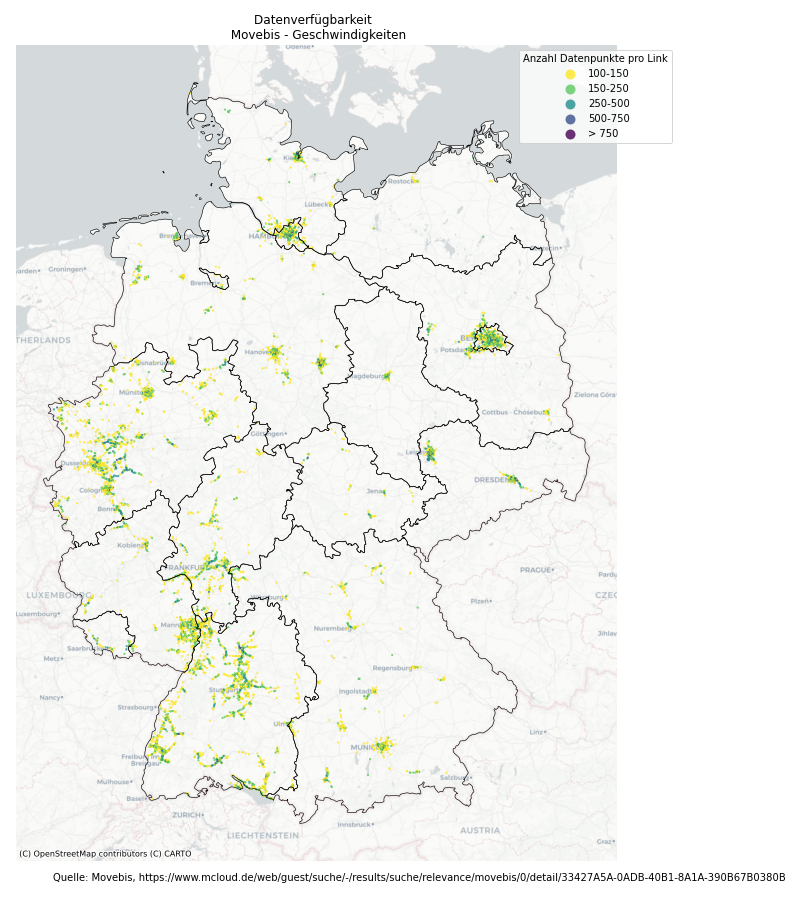
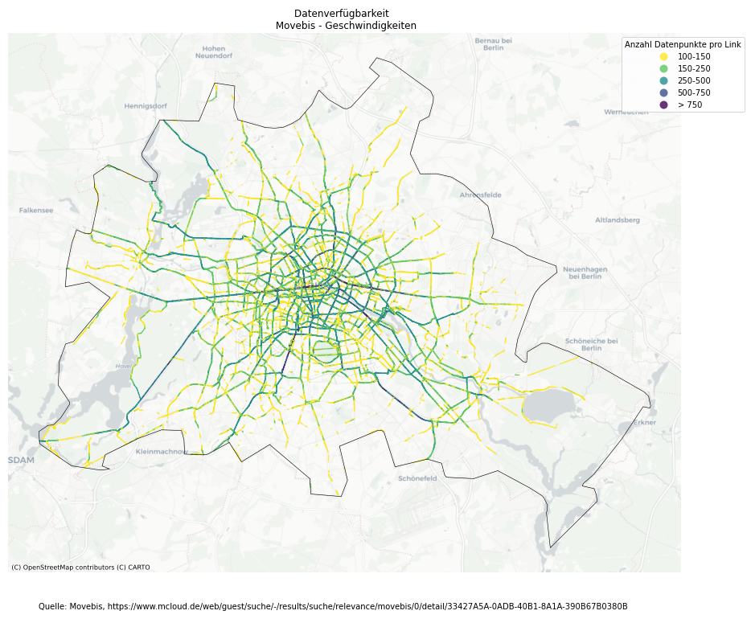
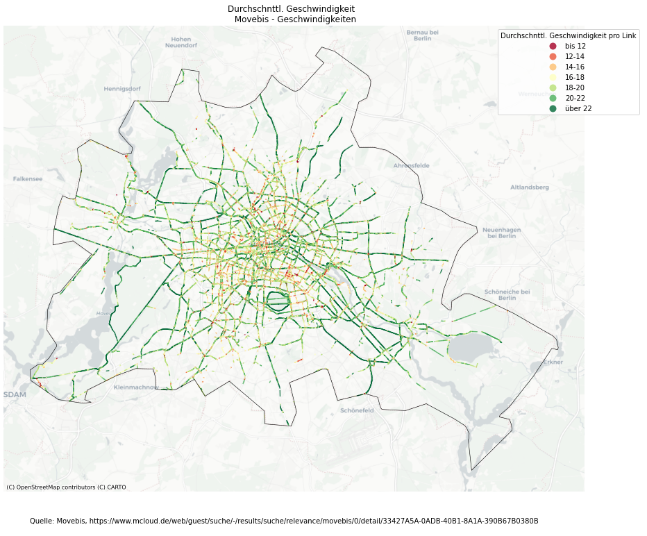

# movebis

Aufbereitung und Darstellung der Radverkehrsdaten aus dem Movebis-Projekt [1].

Im Rahmen von"Stadtradeln" hat das Movebis-Projekt deutschlandweit GPS-Tracks von teilnehmenden Radfahrer*innen gesammelt. Anzahl Beochtungen und durchschnittl. Geschwindigkeiten sind OSM-Links zugefügt worden und können nun auf mcloud [2] heruntergeladen werden.

##  Beispiel Berlin:

Für Berlin sind hier die Datenverfügbarkeit und die Geschwindigkeit statisch darstellst. Für den Berliner Innenring habe ich nun alle Straßenabschnitte  mit mehr als 100 Beobachtungen (~20k) hier dargestellt:
https://vizsim.github.io/movebis/movebis_speed_hundekopf_100.html

Quellen:

[1] https://www.movebis.org/

[2] https://www.mcloud.de/web/guest/suche/-/results/suche/relevance/movebis/0/detail/33427A5A-0ADB-40B1-8A1A-390B67B0380B